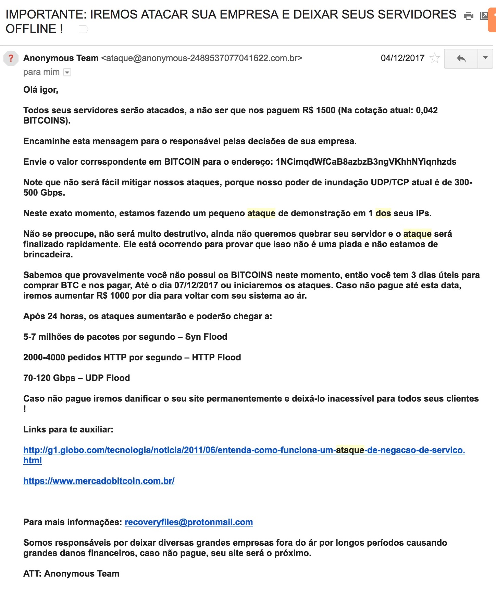
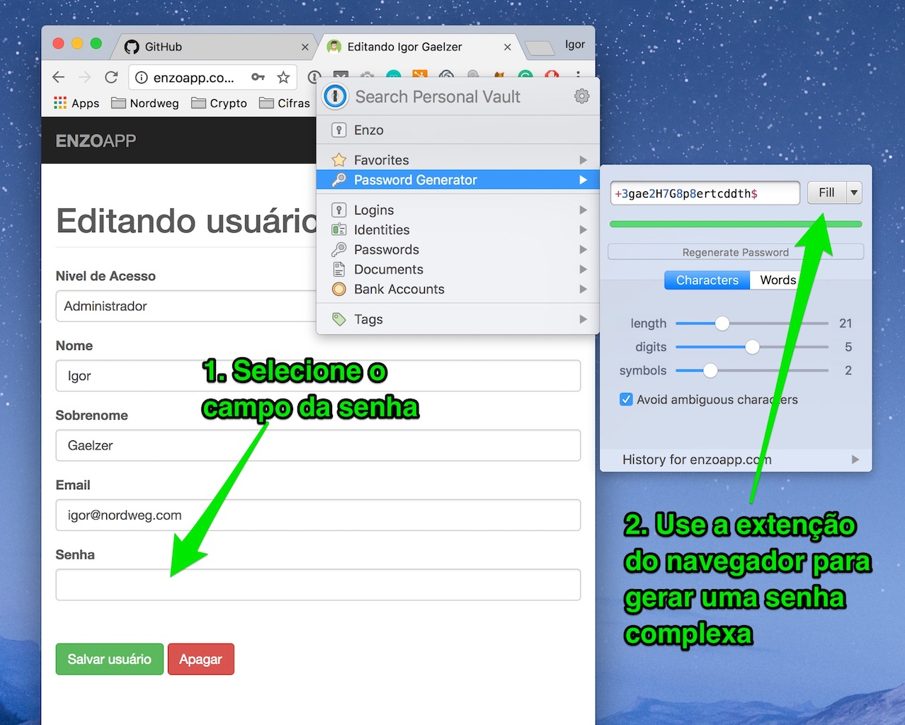

# Segurança e política de senhas

De extrema importância, está a segurança da nossa informação. Você terá acesso a diversos aplicativos, pedidos, dados de clientes, dados financeiros e muito mais.

Hoje em dia, ser invadido e ter informações roubadas ou apagadas é algo realmente fácil de acontecer, caso alguns cuidados básicos não forem tomados. Como uma empresa majoritariamente online, perder nosso site e nossos dados seria basicamente o nosso fim.

A qualquer momento, você poderá receber uma email como este (email real que recebemos). Nestas horas, a realidade bate à porta e percebemos que segurança nunca é demais.

***

***

Por isso, utilizamos o aplicativo [1Password](https://1password.com/) para gerenciar nossas credenciais de acesso, gerando uma senha de alta segurança diferente de para cada site e aplicativo.

`Exemplo de senha: 4D4>b4GM8EyJ2fVvRXqQ{`

O 1Password salva estas senhas e a sua extenção para o browser as completa automaticamente, de forma que você jamais precise lembrá-las ou digitá-las. Há também tem o aplicativo para celular.

Nunca passe senhas por email ou mensagens de Slack, WhatsApp e etc. Em contas de aplicativos compartilhados, como o Instagram, você pode compartilhar as credenciais com o time, diretamente pelo o 1Password.

Se enviar uma senha for absolutamente necessário, não envie o login, a senha e o nome do site pelo mesmo canal. Por exemplo, se alguém lhe pedir dados de acesso pelo Slack, passe apenas o login pelo Slack. Depois envie a senha sem nenhuma outra informação por email.

Dessa forma, mesmo que alguém acesse o email e veja uma mensagem com a senha `4D4>b4GM8EyJ2fVvRXqQ{`, não saberá do que se trata. Apague emails com senhas imediatamente após serem recebidos.

Alem da senha individual e de alta segurança, utilize serviços de autenticação por dois passos sempre que possível. Isso aumenta significativamente a segurança e é obrigatório no email, pois com acesso a ele um hacker poderia recuperar a senhas de praticamente todos os outros serviços.

Coisas para lembrar:

  - Utilize o [1Password](https://1password.com/) para gerar uma senha de alta segurança diferente para cada aplicativo.
  - Utilize autenticação de dois passos sempre que possível. Obrigatório no email.

## Instalando o 1Password

1. Receber o convite para fazer parte do time da Nordweg no 1Password para ter senhas compartilhadas.
2. Faça conta no 1Password através do convite recebido.
3. Você será solicitado pra criar uma senha mestre. Importante: Jamais utilize uma senha compartilhada neste passo. Está será sua senha mestra, que dará acesso a todas as outras senhas. Usar uma senha fácil ou já utilizada compromete todo o sistema.
4. Imprimia o Emergency Kit gerado na instalação para a recuperação da senha no futuro.
5. Baixe o [aplicativo no computador](https://1password.com/downloads/) e instale a [extenção do Chrome](https://agilebits.com/onepassword/extensions). Também existe a versão para celular iPhone e Android, que pode facilitar bastante quando você estiver em um novo computador e etc.

## Alterando a senha do Gmail

1. Entre na [página de segurança](https://myaccount.google.com/security) do Google para alterar sua senha.
2. No momento de digitar a nova senha, use o 1Password para gerar uma senha segura, como `4D4>b4GM8EyJ2fVvRXqQ{`.
3. Certifique-se que a nova senha foi salva no 1Password.
